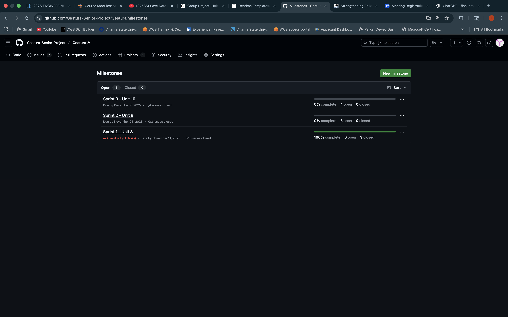
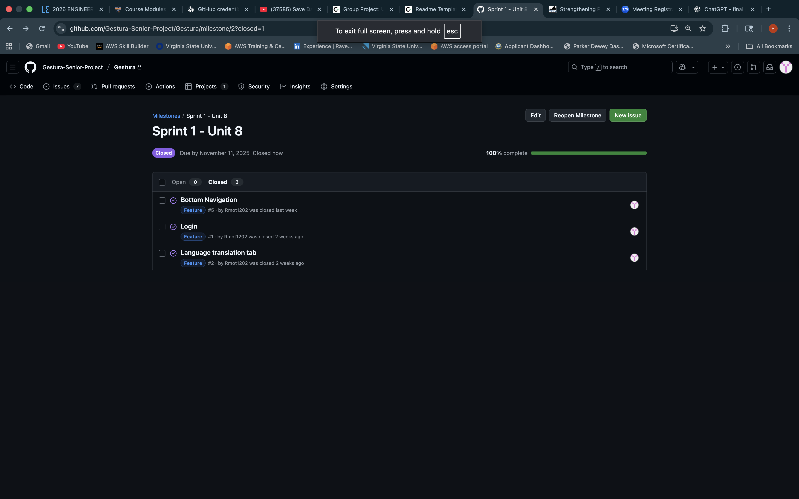
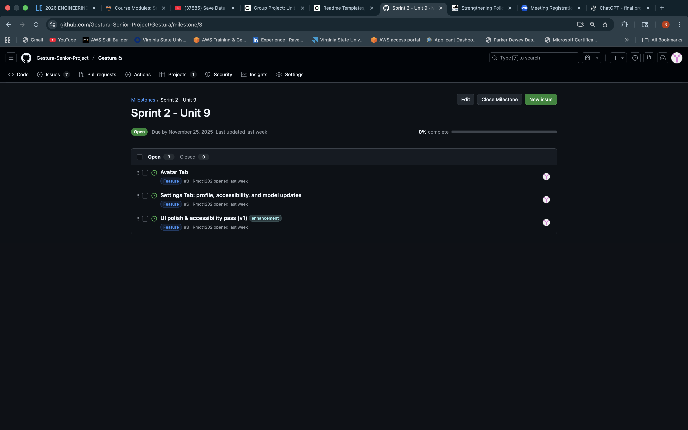
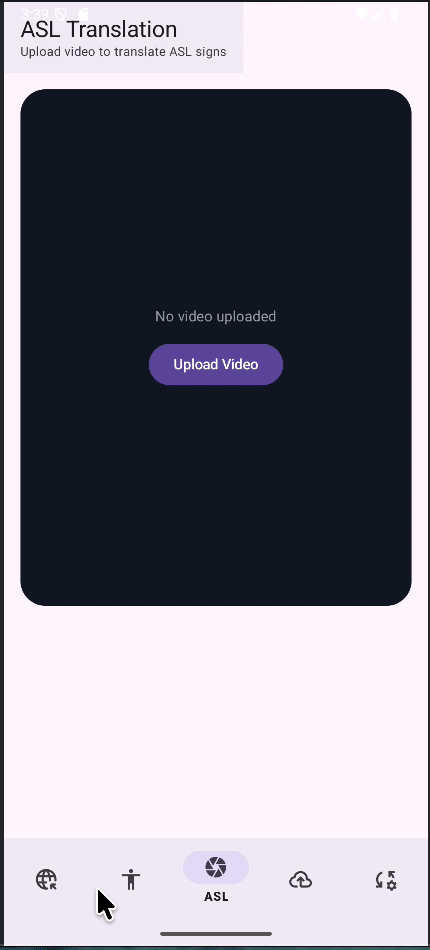
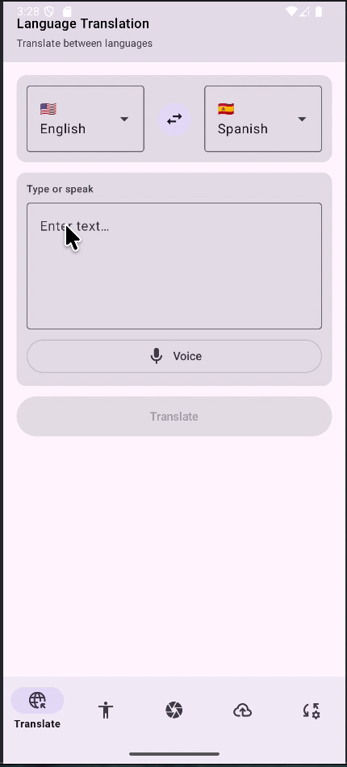
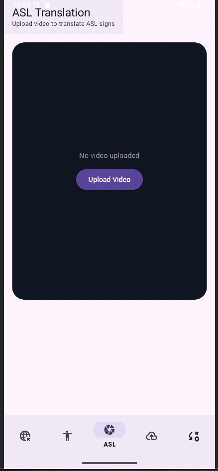
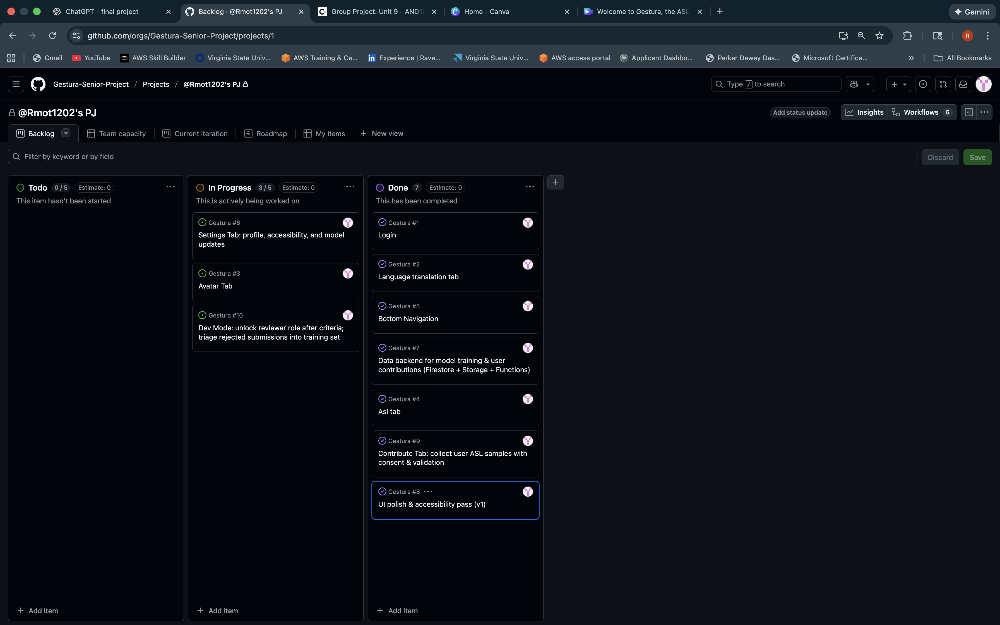
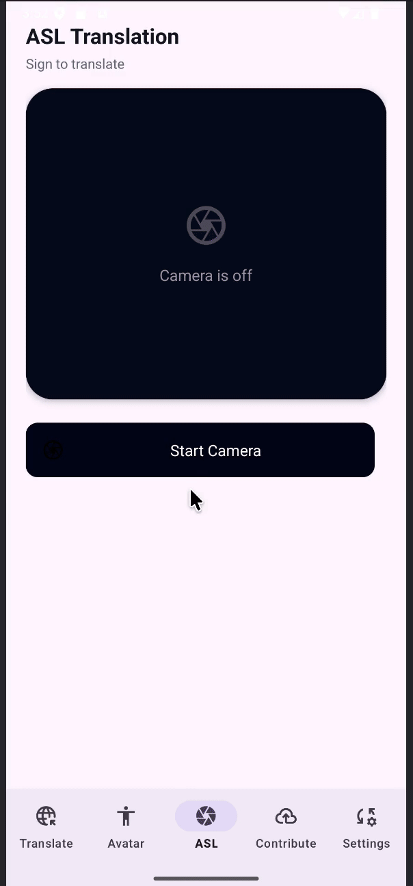
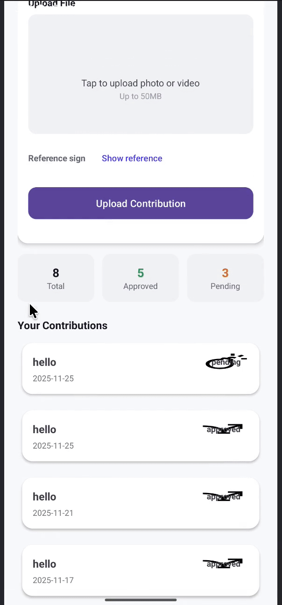

Gestura (Unit 7)

## Table of Contents

1. [Overview](#Overview)
2. [Product Spec](#Product-Spec)
3. [Wireframes](#Wireframes)

---

## Overview

### Description

**Gestura** is an AI-powered mobile app. It translates American Sign Language (ASL) gestures into text and speech — and vice versa — in real time. The app also allows users to learn ASL, contribute gesture data to train models, and stay updated as it with the latest AI model.  
Gestura bridges the communication gap between Deaf and hearing communities through accessibility-focused innovation.

### App Evaluation

- **Category:** Accessibility / Education / AI  
- **Mobile:** Uses the camera for ASL recognition, microphone for voice input, and cloud connectivity for real-time translation and model syncing. Optimized for mobile because gesture tracking, speech input, and AI updates rely on mobile sensors.  
- **Story:** Gestura empowers Deaf and hearing users to communicate seamlessly. It also supports ASL learners and educators through tutorials, practice modules, and a crowd-sourced AI model improvement feature.  
- **Market:** Deaf and hard-of-hearing users, interpreters, students, teachers, and accessibility advocates. Institutions (schools, hospitals, and government offices) can also use it to promote inclusive communication.  
- **Habit:** Users interact daily to translate conversations, practice signing, or contribute gesture samples. Notifications encourage consistent engagement and contribution to improve the AI model.  
- **Scope:**  
  - **V1:** ASL-to-text/speech translation  
  - **V2:** Speech-to-ASL animation (avatar)  
  - **V3:** Cloud-based model updates + gesture data uploads  
  - **V4:** Multilingual translation (e.g., Spanish/Japanese ↔ English via ASL)  

---

## Product Spec

### 1. User Features (Required and Optional)

**Required Features**
1. Camera-based ASL gesture recognition → displays translated text  
2. Text-to-speech conversion for recognized signs  
4. User authentication (Firebase login/sign-up)  
5. Model update button to sync with the latest AI model  
5. Animated ASL avatar for reverse translation (speech/text → sign)  
6. Gesture training feature allowing users to upload new ASL images to the cloud  
7. Multilingual translation support (Spanish, Japanese, etc.)  
8. Offline mode with cached AI models  
9. Dark Mode
10. See number of valid contributions and accuracy

---

### 2. Screen Archetypes

- **Login / Signup Screen**
  - User authentication via Firebase  
  - Redirects to Home after successful login  

- **ASL Translation Screen**
  - Uses camera to recognize ASL gestures  
  - Displays translated text and converts it to speech  
  - Option to save translation to history  

- **Language Translation Screen**
  - Converts spoken or written input app supported languages  

- **Avatar Screen**
  - Displays animated ASL signs in response to text or voice input  
  - Allows speed and clarity adjustments  

- **Contribution Screen**
  - Users upload gesture photos/videos to improve AI models  
  - Includes validation to ensure gesture quality  

- **Settings Screen**
  - Manage account details  
  - Enable/disable mask sync  
  - Trigger model updates  
  - Adjust light/dark mode

---

### 3. Navigation

**Tab Navigation** (Tab to Screen)
* Language Translate  
* ASL Translation Screen  
* Avatar  
* Contribute  
* Settings  

**Flow Navigation** (Screen to Screen)
- **Login Screen**
  - → ASL Translation Screen  

- **ASL Translation Screen **
  - → Language Translation Screen  
  - → Contribute     
  - → Avatar  
  - → Settings
    
- **ASL Translation Screen **
  - → Language Translation Screen  
  - → Contribute     
  - → Avatar  
  - → Settings

- **Avatar Screen**
   - → ASL Translation Screen  
  - → Language Translation Screen  
  - → Contribute     
  - → Settings

- **Contribution Screen**
   - → ASL Translation Screen  
  - → Language Translation Screen  
  - → Avatar  
  - → Settings
    
- **Settings**
  - → ASL Translation Screen  
  - → Language Translation Screen  
  - → Contribute     
  - → Avatar  

---

## Wireframes

 

# Milestone 2 - Build Sprint 1 (Unit 8)

## GitHub Project board

## Issues Cards
**Sprint 1**

**Sprint 2**

---

## Issues worked on this sprint

**Completed (3/3):**
- ✅ **Bottom Navigation** — Implemented Material BottomNavigationView wired to Navigation Component; tab IDs mapped directly to fragment IDs; hides on Login.
- ✅ **Login** — Email/password auth with Firebase (sign-in/sign-up/reset), error states, loading progress, back-stack cleared after auth.
- ✅ **Language translation tab** — Compose-based screen embedded in Fragment; language swap, text input.

---

## Build progress (GIFs)

**Bottom Navigation flow**  

**Language Translation tab**  

**Login flow**  

 

# Milestone 3 - Build Sprint 2 (Unit 9)

## GitHub Project board

## Completed user stories

**Completed (3/3):**
*ASL Tab** — Camera preview, capture pipeline, Holistic → LSTM inference  
- ✅ **Contribute Tab** — Upload gesture samples, store metadata, validation  
- ✅ **Data Backend** — Firestore + Storage + Functions for contributions & model training  
- ✅ **UI Polish (V1)** — Cleaner typography, spacing, accessibility labels
  
**Pending(3/3):**
- ✅**Avatar Tab** — UI built, connecting to live GenASL endpoint  
- ✅**Settings Tab** — Profile, accessibility, model updates, dark mode  
- ✅**Reviewer Mode** — Unlock reviewer view after criteria; triage rejected samples  

## Build progress (GIFs) 

**ASL Translation Flow (Camera → Landmarks → Text)**

**Contribution Flow (Upload → Validate → Submit)**

## App Demo Video

- Embed the YouTube/Vimeo link of your Completed Demo Day prep video

